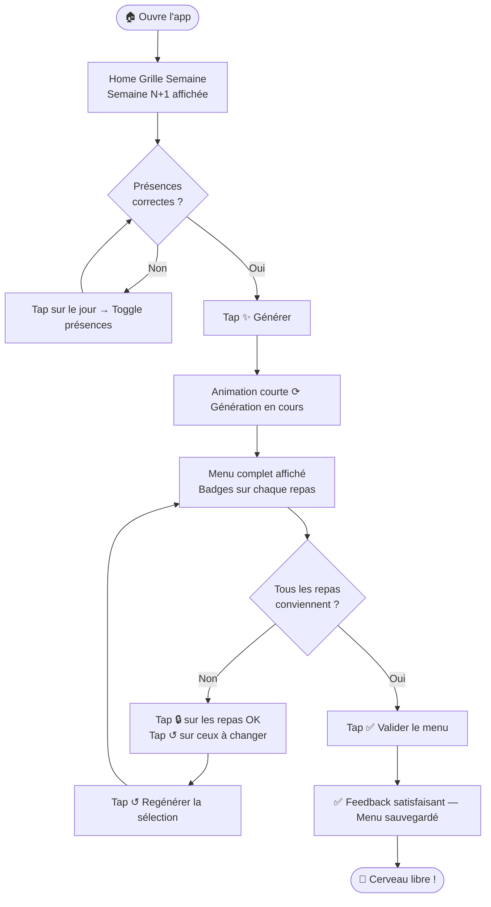
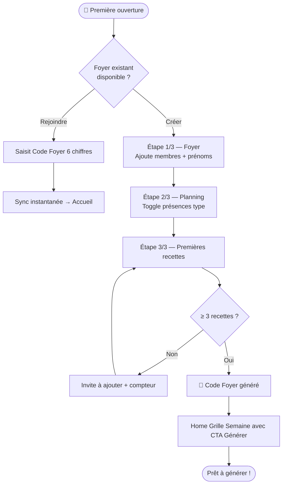
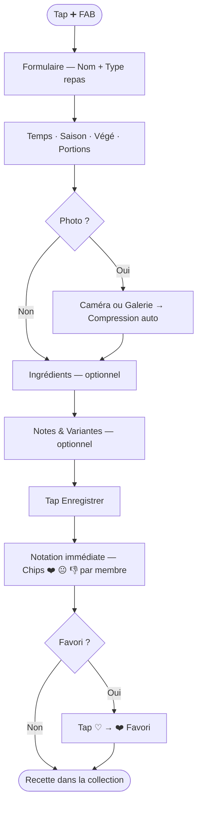
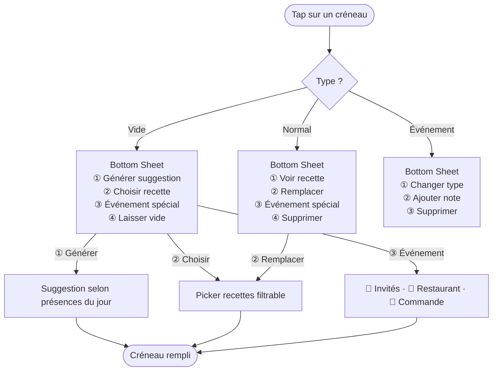

# UX Design Specification - Appli Recette

**Author:** MiKL
**Date:** 2026-02-18

---

## Executive Summary

### Project Vision

Appli Recette est une application mobile personnelle qui élimine la surcharge mentale hebdomadaire du *"qu'est-ce qu'on mange ?"*. En combinant une collection de recettes personnelles enrichissable et une génération intelligente de menus, elle permet à MiKL de planifier la semaine familiale en 2 minutes le dimanche, depuis le canapé, d'une seule main.

L'expérience signature : ouvrir l'app le dimanche, ajuster les présences, appuyer sur "Générer" — et avoir un menu complet qui tient compte des goûts de chacun. Cerveau libre.

### Target Users

**Utilisateur principal : MiKL**
Parent organisateur, foyer de 4 (lui, son partenaire, Léonard 11 ans, Alizée 9 ans). Usage mobile, souvent d'une seule main depuis le canapé. Niveau tech intermédiaire. Priorité : que ça marche vite, sans friction.

**Profils du foyer (utilisateurs indirects influençant la génération) :**
- **Partenaire** : adulte, préférences propres
- **Léonard (11 ans)** : préférences enfant, peut avoir des favoris forts
- **Alizée (9 ans)** : sensible aux épices, préférences à respecter

L'app est mono-utilisateur (MiKL) mais les 4 profils informent l'algorithme de génération.

### Key Design Challenges

1. **Architecture d'information à 3 pôles** — Recettes / Foyer / Planning sont 3 domaines distincts qui doivent coexister sans friction dans une navigation mobile claire et intuitive
2. **Confiance dans la génération** — MiKL doit *sentir* que l'algorithme a tenu compte des préférences de chacun — sans ça, il modifiera systématiquement manuellement
3. **Saisie rapide sur mobile** — Créer une recette depuis le canapé après un bon repas ne doit pas ressembler à remplir un formulaire — formulaire progressif, friction zéro
4. **Onboarding non-intimidant** — 3 étapes maximum, pas un questionnaire. L'app doit donner envie et de la confiance dès la première ouverture

### Design Opportunities

1. **"Dimanche 2 minutes" comme expérience signature** — un écran d'accueil centré sur cette action principale, avec accès immédiat à la génération
2. **FAB omniprésent** — Floating Action Button pour ajouter une recette depuis n'importe quel écran
3. **Notation contextuelle** — chips colorées ❤️ / 😐 / 👎 directement sur la fiche recette, notation immédiate après création
4. **Génération partielle guidante** — pas une erreur froide, une conversation : *"il manque 3 repas, voici tes options"*

---

## Core User Experience

### Defining Experience

L'action centrale de l'Appli Recette est **la génération du menu hebdomadaire**. Tout gravite autour. Le dimanche, MiKL ouvre l'app et génère son menu en 1 tap. Tout le reste (recettes, profils, planning) existe pour que cette action soit parfaite.

Expérience signature : ouvrir l'app le dimanche → ajuster les présences → appuyer "Générer" → menu complet respectant les goûts de chacun. Cerveau libre.

### Platform Strategy

- **Mobile-first exclusif** : iOS ≥ 16 (iPhone) + Android ≥ 10
- **Touch one-handed** : conçu pour le pouce droit, zone basse de l'écran
- **Offline-first de fait** : 100% fonctionnel sans connexion internet
- **Périmètre strict** : pas de tablet, pas de web — smartphone uniquement

### Effortless Interactions

| Interaction | Objectif |
|---|---|
| Générer un menu | 1 tap depuis l'accueil |
| Ajouter une recette | FAB accessible depuis tous les écrans |
| Ajuster les présences | Toggle rapide par membre/repas |
| Remplacer un repas généré | Tap sur le repas → picker recette |
| Noter un membre sur une recette | Chips ❤️ / 😐 / 👎, tap unique |

### Critical Success Moments

1. **La première génération** — doit surprendre positivement. Si le premier menu est décevant, la confiance est brisée durablement
2. **Ajouter la 1ère recette** — doit être rapide et sans friction. Si c'est laborieux, l'onboarding échoue avant même de commencer
3. **Voir ses préférences respectées** — MiKL doit *voir* qu'Alizée n'a pas de recette épicée quand elle est présente

### Experience Principles

1. **"Dimanche en 2 minutes"** — l'action principale est toujours à 1 tap depuis l'accueil
2. **"Pouce d'abord"** — toutes les actions clés dans la zone basse, accessibles à une main
3. **"Confiance méritée"** — l'algorithme est transparent sur *pourquoi* il a choisi chaque recette
4. **"Friction zéro à la création"** — le FAB est toujours là, la saisie minimale suffit pour démarrer

---

## Desired Emotional Response

### Primary Emotional Goals

**Soulagement + Légèreté.**

*"Ce truc pense à ma place, et il fait ça bien."*

C'est le sentiment qui doit dominer après chaque génération réussie. Pas de l'excitation, pas de la surprise — juste le confort tranquille de savoir que la semaine est gérée.

### Emotional Journey Mapping

| Moment | Émotion cible | À éviter |
|---|---|---|
| Première ouverture | Curiosité + espoir | Intimidation |
| Onboarding | Confiance progressive | Sentiment d'être interrogé |
| Première génération | Soulagement + agréable surprise | Déception, scepticisme |
| Usage régulier (dimanche) | Légèreté, habitude fluide | Ennui, friction |
| Génération incomplète | Guidé, pas abandonné | Panique, blocage |
| Ajout d'une recette | Satisfaction immédiate | Laborieux, décourageant |

### Micro-Emotions

- **Confiance** (pas scepticisme) — l'algorithme a l'air de savoir ce qu'il fait
- **Accomplissement** (pas frustration) — j'ai bien configuré, ça se voit dans le résultat
- **Légèreté** (pas charge mentale) — l'app fait le travail, pas moi

### Design Implications

| Émotion | Choix UX |
|---|---|
| Soulagement | Home épuré centré sur "Générer", pas de bruit visuel |
| Confiance | Transparence algo — petit label "Favori de Léonard 🧡" sur chaque repas |
| Légèreté | Animations douces, pas de notifications, aucune urgence |
| Guidé | Messages d'erreur humains, toujours une porte de sortie |
| Satisfaction | Confirmation visuelle après validation du menu |

### Emotional Design Principles

1. **Soulagement avant tout** — chaque interaction doit réduire la charge mentale, jamais l'augmenter
2. **Confiance visible** — l'algorithme explique ses choix, discrètement mais clairement
3. **Jamais d'impasse** — chaque erreur ou cas limite a une sortie humaine et guidante
4. **Validation émotionnelle** — les actions importantes (menu validé, recette créée) méritent un feedback satisfaisant

---

## UX Pattern Analysis & Inspiration

### Inspiring Products Analysis

**Spotify — "Algorithme qui mérite la confiance"**
Spotify génère des playlists personnalisées et montre *pourquoi* ("Basé sur tes écoutes récentes"). Ce modèle de transparence algorithmique est exactement ce dont Appli Recette a besoin pour que MiKL fasse confiance à la génération de menu.

**Headspace — "Onboarding serein, pas intimidant"**
3 questions max, pas de formulaire. Une progression douce qui délivre de la valeur dès la première session. Modèle parfait pour l'onboarding en 3 étapes de l'app.

**Apple Rappels / Calendrier natif — "Gestes mobiles naturels"**
Swipe pour supprimer, tap pour éditer, toggle pour cocher. Des interactions que les utilisateurs connaissent déjà — zéro courbe d'apprentissage.

### Transferable UX Patterns

**Navigation :**
- 3 pôles max clairement hiérarchisés (Recettes / Foyer / Planning) — évite la navigation plate à 5 onglets
- Tab bar basse pour accès principal, cohérent avec la zone du pouce

**Interaction :**
- Algorithme transparent : petit label sous chaque repas généré (*"Favori ❤️"*, *"Aimé par Léonard"*, *"Saison : hiver"*)
- Onboarding progressif 3 étapes, valeur immédiate à chaque étape
- Gestes natifs : swipe pour remplacer un repas, tap long pour détails

**Visuel :**
- Cartes aérées, une info principale par carte
- Feedback visuel satisfaisant après actions clés (menu validé, recette créée)

### Anti-Patterns to Avoid

- **Surcharge de config initiale** — demander 20 préférences avant de montrer de la valeur : chez nous, 3 recettes suffisent pour générer
- **Navigation plate à 5 onglets** — trop d'options simultanées complexifient sans raison
- **Algorithme boîte noire** — générer sans expliquer provoque une perte de confiance rapide et des corrections manuelles systématiques

### Design Inspiration Strategy

| | Pattern | Pourquoi |
|---|---|---|
| **Adopter** | Transparence algo à la Spotify | Construit la confiance dans la génération |
| **Adopter** | Onboarding doux à la Headspace | Réduit la friction initiale |
| **Adapter** | Gestes natifs Apple | Familiers, zéro apprentissage |
| **Éviter** | Config lourde avant valeur | Tue l'adoption dès le départ |
| **Éviter** | Navigation à 5 onglets | Complexifie sans raison |

---

## Design System Foundation

### Design System Choice

**Material Design 3 (Google)**

Système de design complet, natif à Flutter (built-in) et excellemment supporté sur React Native (via React Native Paper). Choix optimal pour un développement express en solo sur une app multiplateforme iOS + Android.

### Rationale for Selection

- Composants prêts à l'emploi directement utilisables : Cards, Chips, FAB, Bottom Navigation, Dialogs, Toggles ✅
- Accessibilité intégrée — pas besoin de la reconstruire
- Look moderne et épuré, personnalisable via design tokens de couleur
- Excellente documentation + large communauté = débogage facilité
- Zéro temps perdu sur les fondations — focus total sur les features métier
- Compatible avec le principe "Pouce d'abord" : zones de tap généreuses par défaut

### Implementation Approach

- **Flutter** : Material 3 natif, intégré au framework — aucune dépendance supplémentaire
- **React Native** : React Native Paper (Material Design 3) — bibliothèque mature et maintenue
- Choix final dépend de la décision de l'architecte sur le framework

### Customization Strategy

- **Palette de couleurs** : teintes chaudes et appétissantes (oranges doux, verts herbacés) — app de cuisine, ambiance foyer
- **Typographie** : grande lisibilité, tailles généreuses pour la zone pouce
- **FAB** : proéminent, couleur primaire, toujours visible en bas à droite
- **Chips de notation** : ❤️ rouge / 😐 gris / 👎 bleu-gris — distinction immédiate et colorée
- **Cards recettes** : image en haut, infos essentielles visibles sans tap

---

## User Journey Flows

### P2 — Le Dimanche en 2 minutes (core experience)



### P1 — Onboarding (première ouverture)



### P3 — Ajouter une recette (enrichissement)



### Flow Tap Créneau — Grille Semaine



### Journey Patterns

| Pattern | Usage |
|---|---|
| **Bottom Sheet contextuel** | Toutes les actions sur un créneau |
| **Validation douce** | Confirmation visuelle ✅ sans dialog intrusif |
| **Progressive disclosure** | Formulaire recette : nom d'abord, détails ensuite |
| **Feedback immédiat** | Badge sync ☁️, notation chips, verrouillage 🔒 |
| **Jamais de dead-end** | Toujours une option "Laisser vide" ou "Passer" |

### Flow Optimization Principles

1. **Entrée unique claire** — chaque parcours a un point d'entrée évident (FAB, bouton Générer, tap créneau)
2. **Minimum de taps** — 3 taps max pour les actions principales depuis l'accueil (NFR7)
3. **Récupération gracieuse** — chaque erreur ou cas limite a une sortie humaine
4. **Feedback progressif** — l'utilisateur sait toujours où il en est (progress dots, badges, sync indicator)

---

## Component Strategy

### Design System Components

Material Design 3 couvre directement :

| Composant | Usage |
|---|---|
| FAB | Bouton ➕ global ajout recette |
| Bottom Sheet | Menus contextuels sur créneau |
| Card | Fiches recettes, éléments de liste |
| Chips | Notation ❤️/😐/👎, badges saison/végé |
| Bottom Navigation | Nav principale 4 onglets |
| Top App Bar | Titre page + bouton Générer |
| Snackbar | Confirmations (menu validé, recette créée) |
| Dialog | Confirmations suppression |
| Text Fields | Formulaires recette |
| Switch / Toggle | Présences, filtres végé |
| Progress Indicator | Animation de génération |

### Custom Components

**WeekGridComponent** — Grille semaine centrale (7 jours × 2 repas)
- États : vide / rempli / événement / hors-planning
- Mode post-génération : icônes 🔒 ↺ ✕ sur chaque case
- Scroll horizontal optionnel sur petits écrans

**MealSlotCard** — Case individuelle de la grille
- États : vide | normal | verrouillé | événement (invités/restaurant/commande)
- Contenu : nom recette · badges contextuels · icônes action
- Interaction : tap → bottom sheet | tap long → verrouillage rapide

**MemberRatingRow** — Ligne de notation par membre
- `[Avatar] [Prénom]` + chips `❤️ Aimé` `😐 Neutre` `👎 Pas aimé`
- Tap sur un chip = sélection exclusive

**PresenceToggleGrid** — Grille présences membres × jours, toggles tapables

**SyncStatusBadge** — Indicateur discret sync cloud dans la top bar
- ☁️✅ synchronisé | ☁️⟳ en cours | ☁️⚠️ hors ligne

**RecipeQuickForm** — Formulaire de création progressif
- Section 1 : Nom + Type repas (obligatoire)
- Section 2 : Temps + Saison + Végé (rapide)
- Section 3 : Photo + Ingrédients + Notes (optionnel)

### Component Implementation Strategy

- Tous les composants custom construits sur les tokens Material Design 3
- Cohérence garantie via la palette "Chaleur & Appétit"
- Zones de tap ≥ 48×48px sur tous les composants interactifs
- ARIA labels sur tous les composants custom

### Implementation Roadmap

**Phase 1 — Core (MVP)**
- `WeekGridComponent` + `MealSlotCard` (home complet)
- `MemberRatingRow` (fiche recette)
- `PresenceToggleGrid` (planning + onboarding)

**Phase 2 — Expérience**
- `RecipeQuickForm` progressive (création rapide)
- `SyncStatusBadge` (sync cloud)

**Phase 3 — Polish**
- Animations de génération
- Transitions entre écrans
- Haptic feedback sur verrouillage 🔒

---

## UX Consistency Patterns

### Button Hierarchy

| Niveau | Style | Couleur | Usage |
|---|---|---|---|
| Primaire | Plein, pill 50px | `#E8794A` blanc | Générer, Valider, Enregistrer |
| Secondaire | Outline, pill | Border `#E8794A` | Remplacer, Choisir |
| Texte | Text seul | `#E8794A` | Passer, Annuler, Voir tout |
| Destructif | Texte rouge | `#C0392B` | Supprimer (dans dialog) |
| FAB | Rond surélevé | `#E8794A` | ➕ Ajout recette (global) |

Règle : jamais 2 boutons primaires sur le même écran.

### Feedback Patterns

| Situation | Composant | Durée |
|---|---|---|
| ✅ Action réussie | Snackbar bas `#6BAE75` | 3 sec auto-dismiss |
| ⚠️ Génération incomplète | Card warning `#FFF3E0` | Persistante jusqu'à action |
| ❌ Suppression | Dialog confirmation | Tap confirmer requis |
| ☁️ Sync | Badge top bar | En continu |
| ⟳ Génération en cours | Progress indicator centré | Jusqu'à résultat |

### Form Patterns

- **Saisie progressive** : champs obligatoires d'abord, optionnels ensuite
- **Validation en temps réel** : erreurs inline sous le champ, pas de soumission bloquante
- **Clavier adapté** : numérique pour durées/portions, texte pour noms
- **Enregistrement partiel** : possible dès que le nom est renseigné

### Navigation Patterns

- **Bottom tabs (4)** : Accueil · Recettes · Foyer · Planning
- **Back** : chevron `‹` en haut à gauche sur tous les sous-écrans
- **Bottom sheet** : actions contextuelles sur créneau/recette — drag pour fermer
- **Modal plein écran** : formulaire de création recette (slide-up depuis le bas)

### Additional Patterns

**États vides :**

| Écran | Message | Action |
|---|---|---|
| Aucune recette | "Commence par ajouter une recette 🍳" | Bouton primaire "Ajouter" |
| Menu non généré | "Tape Générer pour planifier ta semaine ✨" | Flèche vers bouton Générer |
| Recherche vide | "Aucune recette ne correspond" | "Effacer les filtres" |
| Foyer vide | "Ajoute les membres de ton foyer 👨‍👩‍👧‍👦" | Bouton "Ajouter un membre" |

**Confirmations destructives :**
- Toujours un Dialog Material : titre + conséquence + annuler + confirmer (rouge)
- Jamais de suppression au swipe sans confirmation explicite

---

## Design Direction Decision

### Design Directions Explored

6 directions explorées via le showcase HTML (`ux-design-directions.html`) :
1. Home "Génération au Centre" — grande CTA + aperçu menu
2. Home "Grille Semaine" — planning complet midi/soir en accueil ✅ **Choisie**
3. Home "Cards Scrollables" — liste verticale des repas
4. Fiche Recette — photo + notation foyer
5. Onboarding Étape 2/3 — planning de présence guidé
6. Génération Incomplète — gestion des cas limites

### Chosen Direction

**Direction 2 — Home "Grille Semaine"**
La grille du menu (lundi→dimanche, midi/soir) occupe l'écran principal. Génération accessible via bouton "✨ Générer" dans la top bar. Validation via bouton "✅ Valider" en bas de grille.

### Types de Créneaux

| Type | Icône | Fond | Comportement algo |
|---|---|---|---|
| Normal | 🍽️ | Blanc + recette + badges | Géré par l'algo |
| Invités | 🎉 | Ambre `#FFF8E1` | Ignoré à la génération |
| Restaurant | 🍴 | Bleu clair `#E8EAF6` | Ignoré à la génération |
| Commande | 🛵 | Lilas `#F3E5F5` | Ignoré à la génération |
| Vide | ⬜ | Bordure pointillée | Rempli si possible |

### Interaction Flow — Tap sur un Créneau

**Créneau vide → Bottom sheet :**
1. 🎲 Générer une suggestion (algo, filtré sur présences du jour)
2. 📖 Choisir dans mes recettes (picker filtrable)
3. 🎉 Événement spécial → sous-choix : Invités / Restaurant / Commande
4. ⬜ Laisser vide

**Créneau Normal → Bottom sheet :**
1. 👁️ Voir la recette
2. 🔄 Remplacer (picker recette)
3. 🎉 Passer en événement spécial
4. 🗑️ Supprimer (confirmation)

**Créneau Événement → Bottom sheet :**
1. ✏️ Changer le type
2. 📝 Ajouter une note (texte libre : "Soirée raclette avec les Martin")
3. 🗑️ Supprimer l'événement

### Génération Sélective — Verrouillage

Après génération, chaque case affiche 3 icônes :
- 🔒 Verrouiller (case ignorée si on regénère)
- ↺ Regénérer cette case uniquement
- ✕ Vider la case

Tap long sur une case remplie = verrouillage rapide. Bouton "↺ Regénérer la sélection" apparaît dès qu'au moins une case est déverrouillée.

### Sync Cloud Familiale — Décision UX

**Révision majeure du PRD :** l'app passe de locale à cloud synchronisé entre appareils du foyer.

**Authentification — Code Foyer :**
- Appareil 1 crée le foyer → reçoit un code à 6 chiffres (ex: 847-392)
- Appareil 2 rejoint via ce code → sync immédiate
- Aucun email, aucun mot de passe

**Droits :**
- Tous les adultes : lecture + écriture complète (recettes, menu, profils)
- Pas de hiérarchie de rôles en V1

**Gestion des conflits :** "Dernier enregistrement gagne"

**Indicateur de sync :** ☁️✅ synchronisé / ☁️⟳ en cours / ☁️⚠️ hors ligne

**Offline-first :** toutes les fonctions opèrent sans connexion, sync automatique au retour du réseau.

### ⚠️ Révisions PRD Requises

> - ~~Données stockées localement~~ → Données cloud + cache local (offline-first)
> - ~~Aucune authentification~~ → Code Foyer 6 chiffres
> - ~~Aucune synchronisation~~ → Sync temps réel entre appareils du foyer
> - ~~Aucune donnée transmise à serveur externe~~ → Backend cloud nécessaire
> - Architecture backend : Supabase recommandé (décision architecte)

### Implementation Approach

- Material Design 3 Bottom Sheet pour tous les menus contextuels de créneau
- Grille semaine construite avec composants Material Card
- Icônes de statut (🔒 ↺ ✕) sur chaque case en mode post-génération
- Sync via backend léger avec cache local SQLite (offline-first)

---

## 2. Core User Experience

### 2.1 Defining Experience

> **"Génère ma semaine en un tap"**

Comme Spotify génère une playlist personnalisée, Appli Recette génère le menu familial — adapté aux présences, aux goûts de chacun, à la saison — en un tap, depuis le canapé.

### 2.2 User Mental Model

**Aujourd'hui (sans l'app) :** MiKL planifie mentalement — calcul des présences, des préférences, de l'anti-répétition, tout en tête → charge cognitive réelle chaque dimanche.

**Avec l'app :** Son rôle passe de **planificateur** à **validateur**. L'algorithme fait le calcul ; MiKL vérifie, ajuste si besoin, valide. Fondamental pour l'adoption durable.

### 2.3 Success Criteria

- Le menu généré est immédiatement crédible — pas besoin de tout modifier
- Chaque repas montre pourquoi il a été choisi — MiKL comprend la logique
- L'ajustement manuel est frictionless — un tap pour remplacer un repas
- La validation prend moins de 10 secondes si le résultat est bon
- Aucun repas détesté par un membre présent n'apparaît — jamais

### 2.4 Novel UX Patterns

**Établis :** grille semaine classique, tap pour éditer, swipe/bouton pour valider.

**Innovation ciblée — le "Pourquoi" visible :**
Chaque carte repas affiche un badge transparent contextuel :
`❤️ Favori` · `🧡 Léonard` · `🌿 Végé` · `❄️ Hiver`
MiKL voit que l'algorithme l'a compris, sans ouvrir la recette. Construit la confiance sans friction.

### 2.5 Experience Mechanics

| Phase | Action utilisateur | Réponse système |
|---|---|---|
| **Initiation** | Ouvre l'app → CTA "Générer la semaine" visible en home | Affiche le planning de présence de la semaine |
| **Ajustement** | Toggle les présences si besoin | Mise à jour visuelle immédiate |
| **Génération** | Tap "Générer" | Animation courte → menu complet avec badges |
| **Révision** | Scroll du menu, tap sur un repas pour remplacer | Picker recette contextuel |
| **Complétion** | Tap "Valider le menu" | Feedback satisfaisant, menu sauvegardé |

---

## Visual Design Foundation

### Color System

**Direction choisie : "Chaleur & Appétit"** — teintes chaudes, oranges doux et terracotta évoquant la cuisine, le foyer et l'appétit.

```
Primary      : #E8794A  — Orange terracotta (actions principales, FAB, CTA)
Secondary    : #F5C26B  — Ambre miel (accents, badges favoris)
Background   : #FDF6EF  — Crème ivoire (fond général)
Surface      : #FFFFFF  — Blanc pur (cards, modals)
On Primary   : #FFFFFF  — Texte sur éléments primaires
Success      : #6BAE75  — Vert basilic (validation, confirmations)
Error        : #C0392B  — Rouge tomate (suppressions, alertes)
Neutral      : #8D6E63  — Brun chaud (texte secondaire)
```

**Chips de notation (spécifiques au projet) :**
```
❤️ Aimé      : #FFE0CC fond / #E8794A texte
😐 Neutre    : #F0F0F0 fond / #757575 texte
👎 Pas aimé  : #E8EAF6 fond / #5C6BC0 texte
```

### Typography System

**Police principale : Nunito** (arrondie, amicale, très lisible sur mobile)
Fallback : Roboto (Material Design default)

| Niveau | Taille | Usage |
|---|---|---|
| Title Large | 22sp | Titre de page |
| Title Medium | 16sp | Titres de section |
| Body Large | 16sp | Contenu principal |
| Body Medium | 14sp | Listes, descriptions |
| Label | 12sp | Badges, chips |

### Spacing & Layout Foundation

- **Unité de base :** 8px (standard Material Design)
- **Padding cards :** 16px
- **Espacement entre éléments :** 12–16px
- **Layout :** aéré, pas dense — respiration visuelle favorisant la légèreté émotionnelle
- **Zones de tap :** minimum 48×48px

### Accessibility Considerations

- Contraste Primary/White (#E8794A sur #FFFFFF) : ratio ≥ 3:1 — conforme WCAG AA pour les grands textes
- Zones de tap généreuses (48×48px min) — utilisabilité à une main
- Tailles de police ≥ 14sp pour tout le contenu lisible
- Couleurs d'erreur et succès distinctes et non ambiguës

---

## Responsive Design & Accessibilité

### Stratégie Responsive

**Périmètre : smartphones uniquement**

L'app est conçue exclusivement pour smartphones iOS et Android. Aucun support tablet ou desktop n'est prévu en V1 ou V2.

| Taille d'écran | Breakpoint | Adaptation |
|---|---|---|
| Small (SE, Mini) | < 375px | Marges réduites à 12px, FAB compact |
| Standard | 375–430px | Layout de référence (iPhone 14 cible) |
| Large (Plus, Max) | > 430px | Grille semaine plus aérée, cartes plus hautes |

**Règles d'adaptation :**
- Polices : min. 14sp corps de texte, min. 16sp actions
- `WeekGridComponent` : colonnes plus larges sur > 430px (≥ 48px par jour)
- Cartes recettes : hauteur d'image +20% sur grands écrans
- Bottom sheet : hauteur max 90% de l'écran sur small, 75% sur large

### Stratégie Breakpoints

**Mobile-first** : on conçoit pour le 375px (iPhone standard) et on élargit.

```
375px — Référence de conception (iPhone 14 Pro, Pixel 8)
< 375px — Compact (iPhone SE, petits Android)
> 430px — Large (iPhone Pro Max, Samsung S Ultra)
```

Pas de media queries tablet/desktop — code simplifié, maintenance réduite.

### Stratégie Accessibilité

**Niveau cible : WCAG AA** (standard industrie)

| Critère | Règle |
|---|---|
| Contraste texte normal | ≥ 4.5:1 |
| Contraste texte large (≥ 18px bold) | ≥ 3:1 |
| Touch targets | Min. 48×48px (Material Design 3 — natif) |
| Labels d'accessibilité | Tous les éléments interactifs ont un `accessibilityLabel` |
| États visuels | Focus, pressed, disabled toujours différenciables |
| Couleur seule | Jamais le seul indicateur d'état (emoji + couleur) |

**Points spécifiques à l'app :**
- Chips de notation ❤️/😐/👎 — texte alternatif : "Aimé", "Neutre", "Pas aimé"
- `MealSlotCard` vide : label "Créneau non assigné — [Jour] [Repas]"
- `MealSlotCard` verrouillé : label inclut "verrouillé" dans l'accessibilité
- Icônes d'action (↺ / 🔒 / ✕) : sempre accompagnées d'un label accessible
- VoiceOver / TalkBack : navigation linéaire logique (ordre DOM = ordre visuel)

**Contraste palette validé :**
- `#3D2B1F` (texte sombre) sur `#FDF6EF` (fond) → 12.8:1 ✅
- `#3D2B1F` sur `#F5C26B` (ambre) → 7.2:1 ✅
- `#E8794A` (primaire) sur `#FDF6EF` (fond) → 3.2:1 — accents visuels et grandes surfaces uniquement
- `#FFFFFF` sur `#C25E2A` (variante primaire foncée) → 4.6:1 ✅ — libellés boutons primaires

**Règle de couleur :** Le primaire orange (#E8794A) ne porte pas de texte de corps. Les libellés des boutons primaires utilisent `#FFFFFF` sur fond `#C25E2A` (variante foncée).

### Stratégie de Tests

**Tests responsifs :**
- Devices prioritaires : iPhone 14 (375px), iPhone 15 Pro Max (430px), Samsung Galaxy S23 (360px)
- Simulateur Xcode + Android Studio pour les extrêmes (iPhone SE = 320px)
- Test spécifique : `WeekGridComponent` 7 colonnes visibles sans scroll horizontal sur 320px

**Tests d'accessibilité :**
- VoiceOver (iOS) : parcours P1 Onboarding + P2 Génération complet
- TalkBack (Android) : idem
- Simulateur daltonisme (Xcode Accessibility Inspector) sur toute la palette
- Vérification contraste : outil Colour Contrast Analyser sur tous les textes ≥ 14sp

### Guidelines d'Implémentation

**Responsive (Flutter) :**
```dart
final width = MediaQuery.of(context).size.width;
final isCompact = width < 375;
final isLarge = width > 430;
final horizontalPadding = isCompact ? 12.0 : isLarge ? 20.0 : 16.0;
final dayColumnWidth = isLarge ? 56.0 : isCompact ? 38.0 : 44.0;
```

**Accessibilité :**
- Chaque composant custom a un `Semantics` wrapping avec un `label` descriptif
- Le label inclut : contexte (membre / jour / repas) + état (verrouillé / événement) + contenu
- Exemple : `"Lundi soir — Poulet rôti, verrouillé"`, `"Notation de Léonard : Aimé"`
